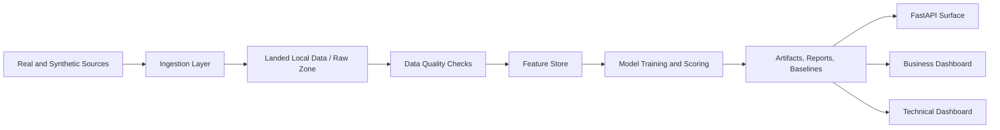
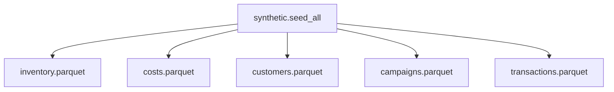
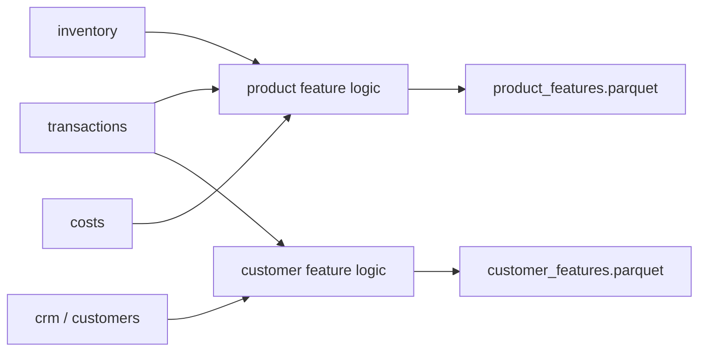
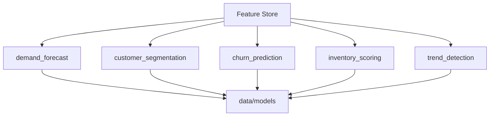
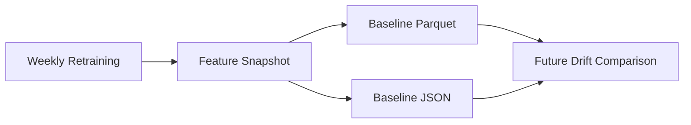
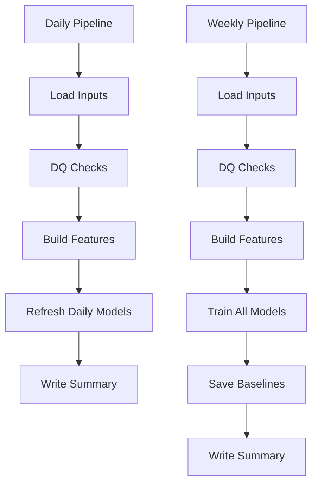

# HealthBeauty360 Technical Report

> **Document purpose**
>
> This report is the detailed engineering reference for the implemented HealthBeauty360 platform. It explains the current technical state of the repository from landed data through feature engineering, model execution, orchestration, serving, dashboards, and operational gaps.

## 1. Executive Technical Summary

HealthBeauty360 is an end-to-end retail analytics platform built around a local-first demo workflow with an upgrade path toward GCP-backed execution. The current implemented system covers synthetic ingestion, data quality validation, feature engineering, five machine learning model workflows, daily and weekly orchestration, artifact persistence, FastAPI serving stubs, and two Streamlit dashboards: one business-facing and one engineering-facing.

In demo mode, the platform runs entirely from local artifacts under `data/`. Synthetic source tables are generated into `data/synthetic`, transformed into model-ready feature matrices under `data/features`, scored and serialized into `data/models`, and monitored through reports in `data/reports` and structured logs in `data/pipeline_logs`.

The project currently operates as a reproducible, inspectable analytics sandbox with a functioning model lifecycle and technical observability surface. It is not yet a full cloud-native production deployment because real-source orchestration and cloud execution remain only partially wired.

---

## 2. System Architecture

The implemented architecture is organized into six functional layers:

1. Data generation and ingestion
2. Data quality and landing validation
3. Feature engineering and feature persistence
4. Model training and scoring
5. Pipeline orchestration and monitoring
6. Serving and dashboard presentation

The actual runtime flow in demo mode is:

`synthetic.seed_all` -> `data/synthetic/*.parquet` -> DQ checks -> feature store build -> model training/scoring -> summaries/logs -> dashboards/API consumption

The core runtime directories are:

- `data/synthetic`: landed demo source data
- `data/features`: persisted feature matrices and metadata
- `data/models`: trained model artifacts and scored outputs
- `data/reports`: pipeline summaries and DQ reports
- `data/pipeline_logs`: structured run logs
- `data/model_baselines`: saved model-monitoring baselines

> **Architecture note**
>
> The currently strongest operational path is local-first demo execution. Non-demo and cloud-backed components exist, but orchestration is not yet fully switching across those paths automatically.

---

## 3. Data Ingestion Layer

### 3.1 Demo-mode ingestion

Demo-mode ingestion is implemented through synthetic generators under `synthetic/`. The entry point is `python -m synthetic.seed_all`, which orchestrates five source datasets:

- inventory
- costs
- customers
- campaigns
- transactions

The synthetic seeder persists parquet files into `data/synthetic`.

The most recent regenerated demo source volumes are:

- inventory: 500 rows
- costs: 500 rows
- customers: 10,000 rows
- campaigns: 49,583 rows
- transactions: 50,000 rows

### 3.2 Real-source ingestion capability

The repository also contains real-source ingestion modules under `ingestion/`, including wrappers for:

- Shopify products
- eBay listings
- Open-Meteo weather
- Google Trends
- ONS retail sales
- ONS internet sales
- UK bank holidays
- UCI online retail
- Open Beauty Facts
- UK trade data

These connectors use environment-based configuration from `ingestion/config.py`. In non-demo mode, the project expects `DEMO_MODE=false`, and some connectors also require source-specific credentials such as `SHOPIFY_STORE_URL`, `SHOPIFY_ACCESS_TOKEN`, and `EBAY_ACCESS_TOKEN`.

### 3.3 Ingestion design assessment

Strengths:

- clean separation between synthetic and real ingestion paths
- reproducible demo workflow with no external dependencies
- typed environment configuration for runtime switching

Limitations:

- daily/weekly orchestration currently consumes local landed artifacts rather than calling real ingestion connectors directly
- source freshness monitoring is available conceptually, but connector-level scheduling and stateful incremental ingestion are not yet unified under one orchestrator

> **Ingestion note**
>
> This is an intentional tradeoff for reproducibility. The project favors being runnable and reviewable on any machine over implying that cloud-native ingestion is already fully productionized.

---

## 4. Data Quality and Validation

### 4.1 Implemented DQ checks

The DQ framework under `data_quality/checks.py` supports structured validation results with statuses `PASS`, `WARN`, and `FAIL`. The daily and weekly pipelines currently apply standard checks to transactions, inventory, and customers.

Implemented checks include:

- row count anomaly
- null validation on required columns
- duplicate detection
- price sanity checks

### 4.2 Current DQ behavior

The latest daily and weekly pipeline summaries both report:

- `status: completed`
- `data_quality_status: PASS`

The latest weekly DQ report shows all current checks passing across:

- transactions
- inventory
- customers

### 4.3 Duplicate handling fix

Initially, transactions failed DQ because synthetic generation produced repeated `invoice_id + stock_code` combinations. That issue has now been fixed in two places:

1. The synthetic transaction generator was redesigned so the same SKU is not repeated within a single invoice.
2. The duplicate DQ rule was made more defensible by checking a fuller line-item key:

`invoice_id + stock_code + invoice_date + quantity + unit_price_gbp`

This change resolved the false-positive DQ failure and better reflects transactional retail data semantics.

### 4.4 DQ design assessment

Strengths:

- structured, machine-readable DQ output
- pipeline-level DQ summary persisted to disk
- deterministic validation logic suitable for dashboard rendering

Limitations:

- DQ is currently rule-based only
- no row-level error sample export yet
- no historical DQ trend aggregation beyond stored JSON logs

> **Validation note**
>
> The DQ layer is already useful because it is persisted and machine-readable. That makes it suitable for dashboards and post-run inspection, not just console output.

---

## 5. Feature Engineering Layer

Feature engineering is implemented under `features/` with a central feature store class in `features/feature_store.py`.

### 5.1 Implemented feature domains

Demand and product features:

- rolling demand windows
- price variability
- seasonality flags
- ABC/XYZ classifications
- stockout probability
- days cover

Customer features:

- recency, frequency, monetary value
- average order value
- basket size
- category breadth
- days between orders
- purchase trend
- preferred season

Calendar features:

- cyclic month and week encodings
- quarter, fiscal quarter
- season labels

### 5.2 Current persisted feature outputs

Latest feature-store outputs:

- `product_features`: 500 rows, 23 columns
- `customer_features`: 3,224 rows, 28 columns

The customer feature count is lower than total CRM customer count because only customers with sufficient transactional history are represented in the behavioral feature layer.

### 5.3 Feature engineering design assessment

Strengths:

- shared feature store abstraction with metadata sidecars
- reusable domain-specific feature modules
- catalog registry describing feature purpose, refresh cadence, and leakage risk

Limitations:

- no point-in-time joins against real warehouse snapshots yet
- no explicit feature versioning beyond persisted files and timestamps
- no online/offline feature parity layer

> **Feature-store note**
>
> The feature layer is one of the strongest parts of the project because it turns raw landed data into reusable analytical assets rather than model-specific one-off transformations.

---

## 6. Model Layer

Five model workflows are implemented under `models/`.

### 6.1 Demand forecast

Purpose:

- weekly SKU demand forecasting

Implementation:

- recursive ridge-based weekly forecaster
- lag, rolling, and seasonal inputs
- fallback strategy for sparse or short-history SKUs

Latest training summary:

- SKU count: 500
- forecast horizon: 8 weeks
- mean validation MAPE: 0.6439
- fallback SKU count: 0

Current output volume:

- 4,000 forecast rows

Assessment:

- appropriate for a demo and controlled synthetic environment
- metric quality is usable for illustration but not yet production-grade forecasting performance

### 6.2 Customer segmentation

Purpose:

- group customers into commercially meaningful clusters

Implementation:

- KMeans clustering on standardized RFM and behavioral features

Latest summary:

- customer count: 3,224
- segment count: 5
- largest segment: `Dormant`

Assessment:

- good for CRM demonstration and dashboard storytelling
- segment naming is deterministic and business-oriented
- clustering is unsupervised and should be monitored for segment stability if extended to real data

### 6.3 Churn prediction

Purpose:

- estimate churn probability for transaction-active customers

Implementation:

- logistic regression with standardized numerical features and one-hot encoded categorical variables

Latest summary:

- customer count: 3,224
- positive rate: 0.7627
- ROC-AUC: 0.4991
- accuracy: 0.7630

Assessment:

- current accuracy largely reflects class imbalance
- ROC-AUC near random indicates the current synthetic label construction is not strongly predictive
- this model is structurally complete but analytically weak in the present demo data regime

### 6.4 Inventory scoring

Purpose:

- prioritize replenishment and identify stock-health issues

Implementation:

- business-rule weighting plus Isolation Forest anomaly scoring

Latest summary:

- SKU count: 500
- reorder recommended count: 438
- mean stockout risk score: 29.52

Assessment:

- pragmatic hybrid scoring approach
- useful for operational prioritization
- threshold tuning will matter significantly if extended beyond synthetic data

### 6.5 Trend detection

Purpose:

- identify accelerating, growing, stable, and declining demand patterns

Implementation:

- rolling demand diagnostics plus relative trend slopes and spike scores

Latest summary:

- SKU count: 500
- accelerating count: 3
- declining count: 218

Assessment:

- interpretable and dashboard-friendly
- suitable for assortment watchlists
- would benefit from explicit confidence thresholds or change-point logic if expanded for production use

> **Modeling note**
>
> The model layer is valuable not only because five workflows exist, but because they are all artifact-backed and orchestrated. That is a stronger engineering signal than isolated notebook models.

---

## 7. Model Monitoring

Model drift and baseline persistence are implemented under `monitoring/model_monitor.py`.

Current capabilities:

- PSI computation
- KS test for numerical drift
- chi-squared comparison for categorical drift
- baseline persistence as parquet plus summary JSON

The weekly pipeline persists baselines for:

- demand forecast feature space
- churn prediction feature space

Assessment:

- strong foundation for offline drift analysis
- currently baseline persistence exists, but full automated drift reporting is not yet integrated into the dashboards or orchestration summaries

---

## 8. Orchestration Layer

### 8.1 Daily pipeline

Implemented in `orchestration/daily_pipeline.py`.

Responsibilities:

- load current landed inputs
- run DQ checks
- rebuild feature matrices
- refresh daily model outputs for inventory, churn, and trend detection
- write pipeline and DQ summaries

Latest daily output summary:

- DQ: PASS
- product features: 500 x 23
- customer features: 3,224 x 28
- inventory scoring rows: 500
- churn scoring rows: 3,224
- trend detection rows: 500

### 8.2 Weekly pipeline

Implemented in `orchestration/weekly_pipeline.py`.

Responsibilities:

- load current landed inputs
- run DQ checks
- rebuild feature matrices
- retrain all five model workflows
- persist monitoring baselines
- write pipeline summary

Latest weekly output summary:

- DQ: PASS
- demand forecast rows: 4,000
- customer segments rows: 3,224
- churn scores rows: 3,224
- inventory scores rows: 500
- trend detection rows: 500

### 8.3 Run logging

Pipeline logging is implemented in `monitoring/pipeline_monitor.py`.

Latest weekly run example:

- run ID: `adc18013`
- status: completed
- duration: 182.7 seconds
- completed steps:
  - load_inputs
  - data_quality
  - feature_store
  - train_models
  - save_baselines
  - write_summary

Assessment:

- run state and row counts are logged reliably
- per-step durations are not yet captured, which limits deep operational profiling

> **Orchestration note**
>
> The orchestration layer is functionally complete for local demo execution. The main missing capability is deeper operational telemetry rather than basic correctness.

---

## 9. Serving Layer

The FastAPI serving surface exists in `serving/api.py`.

Current endpoints include:

- health
- forecast
- customer segment
- churn risk
- inventory score
- executive KPI endpoint

Current state:

- the serving layer is operational as a demo API surface
- several endpoints still return synthetic/demo-calculated outputs rather than loading the most recent trained artifacts

Assessment:

- useful for UI and integration demos
- not yet a true artifact-backed inference service

---

## 10. Dashboard Layer

Two dashboards are now implemented.

### 10.1 Business dashboard

File: `dashboards/app.py`

Purpose:

- commercial and operational reporting
- demand, customer, inventory, and trend views

Recent improvements:

- darker and less visually harsh theme
- more chart coverage
- dynamic insight text for each major visual

### 10.2 Technical dashboard

File: `dashboards/technical_app.py`

Purpose:

- engineering and ML operations visibility
- show the system from ingestion through DQ, features, models, orchestration, and artifacts

Coverage:

- architecture
- ingestion
- DQ
- features
- models
- pipelines
- environment

Assessment:

- this split is appropriate because it separates business consumption from technical observability

> **Dashboard note**
>
> The two-dashboard design is a meaningful architectural decision. It shows awareness that operational and commercial stakeholders need different interfaces over the same underlying artifacts.

---

## 11. Infrastructure Layer

Infrastructure scaffolding exists under `infra/` with Terraform definitions and a root `Dockerfile`.

Terraform currently defines:

- Google provider
- raw-zone storage bucket
- artifacts storage bucket
- service account
- Cloud Run service
- Cloud Scheduler job

Assessment:

- solid scaffold for deployment discussion and future implementation
- not yet fully aligned to all runtime paths and orchestration behaviors in the local-first demo stack

---

## 12. Test Coverage

Focused pytest coverage has been added for:

- model workflows
- orchestration flows
- synthetic transaction uniqueness behavior

Current validated command:

`"c:/Users/USER/Documents/Python Projects/retail-analytics/.venv/Scripts/python.exe" -m pytest tests/test_models.py tests/test_orchestration.py`

Latest result:

- 6 tests passed

Assessment:

- current tests cover the main happy path from synthetic data through orchestration
- there is still room for negative-path tests, API tests, and dashboard smoke tests

---

## 13. Key Strengths

The strongest technical qualities of the current project are:

- reproducible end-to-end demo execution
- clear separation of ingestion, features, models, and orchestration
- persisted artifacts that make the system inspectable after each run
- functioning DQ surface with machine-readable output
- dual dashboards for business and engineering audiences
- model lifecycle that is testable and locally verifiable

---

## 14. Current Technical Gaps

The most important gaps are:

1. Real-source orchestration is not fully wired into the daily/weekly pipelines.
2. FastAPI endpoints are not fully artifact-backed.
3. Churn model quality is weak under the current synthetic label regime.
4. Step-level pipeline timing is not yet logged.
5. Warehouse-native medallion execution remains more scaffolded than operational.
6. No CI pipeline is currently enforcing dashboard, API, and orchestration smoke checks together.

---

## 15. Recommended Next Engineering Steps

### Short-term

1. Wire orchestration to real ingestion modules when `DEMO_MODE=false`.
2. Serve model outputs directly from persisted artifacts in `serving/api.py`.
3. Add step-duration logging to `PipelineMonitor`.
4. Expose DQ history and baseline drift history directly in the technical dashboard.

### Medium-term

1. Add API integration tests and dashboard smoke tests.
2. Add CI for synthetic regeneration, daily pipeline, weekly pipeline, and pytest.
3. Introduce stronger synthetic label generation for churn and demand realism.
4. Add warehouse and object-store adapters for non-demo mode execution.

### Longer-term

1. Introduce model registry semantics and artifact version promotion.
2. Add feature drift and prediction drift monitoring into automated weekly reports.
3. Add online serving parity between API responses and latest weekly model artifacts.

---

## 16. Conclusion

HealthBeauty360 is now a technically coherent demo analytics platform with working ingestion, validation, feature engineering, model execution, observability, and dashboard layers. The system is strong as a portfolio-grade and engineering-demo environment because it is reproducible, inspectable, and test-backed.

Its current maturity is best described as advanced demo / pre-production prototype rather than production system. The architecture is credible, the model lifecycle is implemented, the pipelines are functional, and the monitoring surface is real. The remaining work is primarily around cloud-native operationalization, stronger real-data integration, and production-grade serving behavior.