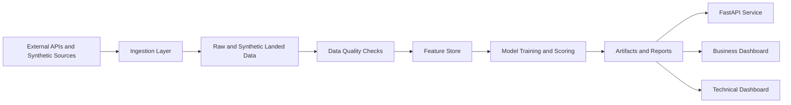
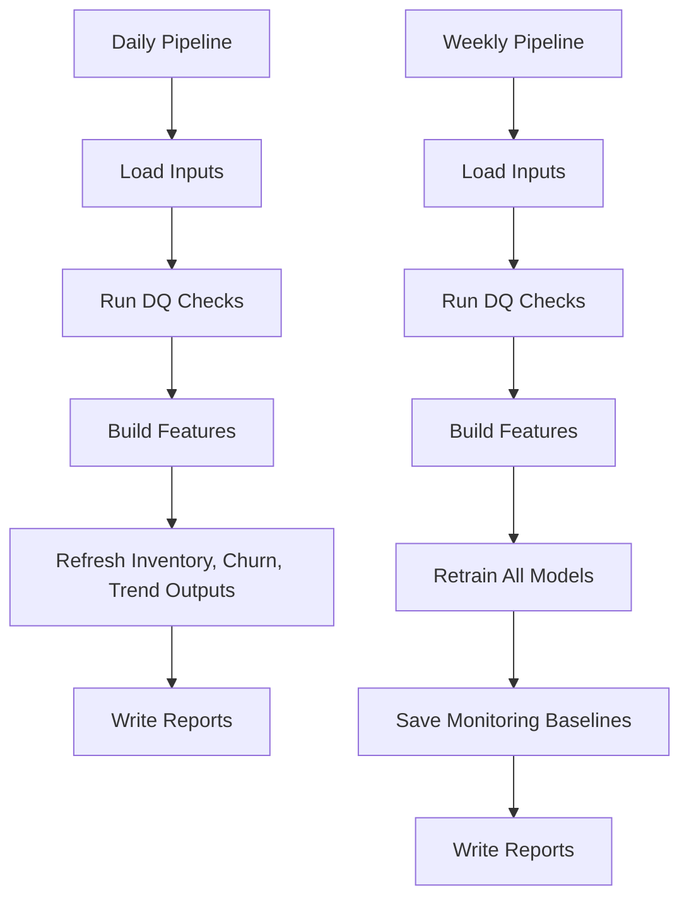

# HealthBeauty360 Portfolio Technical Report

> **Project framing**
>
> HealthBeauty360 is a portfolio-grade retail intelligence platform designed to demonstrate end-to-end data engineering, machine learning operations, analytics serving, and technical storytelling in a single reproducible repository.

---

## 1. Why This Project Exists

HealthBeauty360 was built to answer a specific technical challenge: how do you demonstrate a realistic analytics platform without depending on paid infrastructure, proprietary enterprise data, or inaccessible credentials?

The solution in this repository is a local-first retail analytics stack that can:

- ingest realistic multi-domain source data
- validate and persist structured datasets
- engineer model-ready features
- train and score multiple analytical models
- expose results through APIs and dashboards
- remain fully reproducible in demo mode on a local machine

That makes the project useful in two ways:

1. as a technical proof of implementation
2. as a portfolio artifact that shows systems thinking beyond isolated notebooks or standalone models

---

## 2. Architecture At A Glance



### Implemented runtime directories

- `data/synthetic`: landed demo-mode inputs
- `data/features`: feature matrices and metadata
- `data/models`: model artifacts and scored outputs
- `data/reports`: pipeline and DQ reports
- `data/pipeline_logs`: execution logs
- `data/model_baselines`: monitoring baselines

> **Technical note**
>
> The repo supports both demo and non-demo patterns, but the fully operational path today is local demo mode with persisted artifacts. That tradeoff is intentional: it keeps the system demonstrable and testable without cloud lock-in.

---

## 3. System Walkthrough

### 3.1 Ingestion

The ingestion layer is split between:

- synthetic generators under `synthetic/`
- real-source adapters under `ingestion/`

In demo mode, the project starts with:

```bash
python -m synthetic.seed_all
```

This generates the following landed demo datasets:

- inventory
- costs
- customers
- campaigns
- transactions

Current demo source scale:

- inventory: 500 rows
- costs: 500 rows
- customers: 10,000 rows
- campaigns: 49,583 rows
- transactions: 50,000 rows

### 3.2 Validation

The orchestration layer applies standard DQ checks to landed data before feature generation and modeling. Checks include:

- row count validation
- null checks on critical columns
- duplicate detection
- sanity checks such as price ranges

The latest daily and weekly runs now both pass DQ after the synthetic transaction generator and transaction uniqueness rule were corrected.

### 3.3 Feature engineering

Feature engineering is implemented as reusable modules and a central feature store. Current persisted outputs are:

- `product_features`: 500 rows x 23 columns
- `customer_features`: 3,224 rows x 28 columns

These matrices provide the training and scoring surface for the implemented ML workflows.

### 3.4 Modeling

Five analytical model workflows are implemented:

1. demand forecasting
2. customer segmentation
3. churn prediction
4. inventory scoring
5. trend detection

### 3.5 Serving and presentation

Outputs are surfaced through:

- a FastAPI layer for model-related endpoints
- a business-facing Streamlit dashboard
- a separate engineering-facing technical dashboard

---

## 4. Pipeline Design



### Daily pipeline

The daily pipeline is designed for operational refresh rather than full retraining. It:

- loads current artifacts
- validates input quality
- rebuilds features
- refreshes operational scoring outputs
- writes updated reports

### Weekly pipeline

The weekly pipeline handles heavier model lifecycle work. It:

- validates the latest landed data
- rebuilds features
- retrains all model workflows
- saves monitoring baselines
- updates artifacts used by dashboards

> **Technical note**
>
> Execution logging currently captures run-level timing and per-step row counts, but not per-step elapsed durations. That is a deliberate next-step enhancement opportunity and a useful talking point in a portfolio review.

---

## 5. Model Layer Detail

### Demand Forecast

- Implementation: recursive ridge-based weekly forecaster
- Coverage: 500 SKUs
- Current forecast output: 4,000 rows
- Current mean validation MAPE: 0.6439

### Customer Segmentation

- Implementation: KMeans clustering over RFM and behavioral features
- Current scored customers: 3,224
- Segment count: 5
- Largest segment: Dormant

### Churn Prediction

- Implementation: logistic regression with encoded categorical drivers
- Current customer count: 3,224
- Positive class rate: 0.7627
- ROC-AUC: 0.4991
- Accuracy: 0.7630

### Inventory Scoring

- Implementation: business scoring blended with anomaly detection
- Current SKU count: 500
- Reorder recommendations: 438
- Mean stockout risk score: 29.52

### Trend Detection

- Implementation: rolling demand diagnostics plus slope/spike classification
- Current SKU count: 500
- Accelerating SKUs: 3
- Declining SKUs: 218

> **Interpretation note**
>
> Not every metric is strong in a business sense, especially churn ROC-AUC. That is acceptable here because the project value is not only predictive accuracy. It is also about demonstrating the full engineering lifecycle around models: data contracts, feature generation, orchestration, monitoring, persistence, and presentation.

---

## 6. Dashboards

### Business dashboard

The business-facing dashboard is meant to show commercial value and operational actions. It covers:

- KPI overview
- demand forecast detail
- segmentation and churn outputs
- inventory prioritization
- demand trend tracking

### Technical dashboard

The technical dashboard exists to explain the system itself. It covers:

- architecture and flow
- landed source volumes
- DQ pass/fail states
- feature-store output shape and distributions
- model summaries and drivers
- pipeline runs, durations, and row volumes
- environment and artifact state

This split is intentional and important. It demonstrates product thinking: business users and engineering users should not be forced into the same interface.

---

## 7. Testing And Validation

Focused pytest coverage validates the core implemented system:

```bash
"c:/Users/USER/Documents/Python Projects/retail-analytics/.venv/Scripts/python.exe" -m pytest tests/test_models.py tests/test_orchestration.py
```

Latest validated result:

- 6 tests passed

Coverage includes:

- model training happy paths
- orchestration execution
- synthetic transaction uniqueness behavior

---

## 8. What This Project Demonstrates Technically

This repository demonstrates more than model training.

### Data engineering

- synthetic and real-source ingestion structure
- parquet persistence
- environment-driven runtime configuration
- pipeline-stage separation

### Analytics engineering

- reusable feature engineering modules
- central feature store abstraction
- artifact-backed reporting

### Machine learning engineering

- multiple independent model workflows
- shared serialization utilities
- baseline persistence and drift primitives
- scheduled retraining semantics

### Software engineering

- modular package layout
- typed Python components
- local testability
- Streamlit and FastAPI integration
- Terraform and Docker scaffolding

### Product and communication thinking

- business-facing dashboard and engineering-facing dashboard split
- technical reporting layer
- explicit documentation of strengths, gaps, and next steps

---

## 9. Strengths And Limitations

### Strengths

- fully reproducible local demo workflow
- end-to-end artifact persistence
- clear layer boundaries across the stack
- functioning orchestration with real outputs
- validated DQ surface
- portfolio-friendly technical presentation

### Limitations

- non-demo orchestration is not yet fully wired to real connectors
- API serving still uses some demo-style responses rather than strictly artifact-backed inference
- some model quality is constrained by synthetic label realism
- pipeline monitor does not yet record step-level timings

These are acceptable limitations for a serious portfolio project, provided they are explained clearly. In fact, explaining them well is part of the technical maturity signal.

---

## 10. Suggested Portfolio Positioning

This project should be presented as:

> A reproducible retail analytics platform demonstrating ingestion, validation, feature engineering, ML workflows, orchestration, monitoring, and dashboard delivery in a single Python codebase.

That framing is stronger than describing it only as a forecasting or dashboard project.

It is especially relevant for roles involving:

- data engineering
- analytics engineering
- machine learning engineering
- applied data science
- platform-oriented analytics work

---

## 11. Recommended Next Steps

1. Wire non-demo orchestration directly into real ingestion modules.
2. Make FastAPI endpoints read the latest trained artifacts rather than returning demo-calculated results.
3. Add step-level pipeline timing and historical trend charts.
4. Add CI that runs synthetic refresh plus daily/weekly pipeline smoke tests.
5. Strengthen the churn label regime to improve model realism.

---

## 12. Closing Assessment

HealthBeauty360 is now technically credible as both a demonstrable analytics platform and a portfolio artifact. It is stronger than a notebook-only ML project because it shows how data and models move through an implemented system. It is also stronger than a pure dashboard demo because the dashboards are backed by generated artifacts, validation logic, and reproducible pipelines.

The project is best described as an advanced local-first analytics prototype with working orchestration and model lifecycle components, ready for further operationalization.